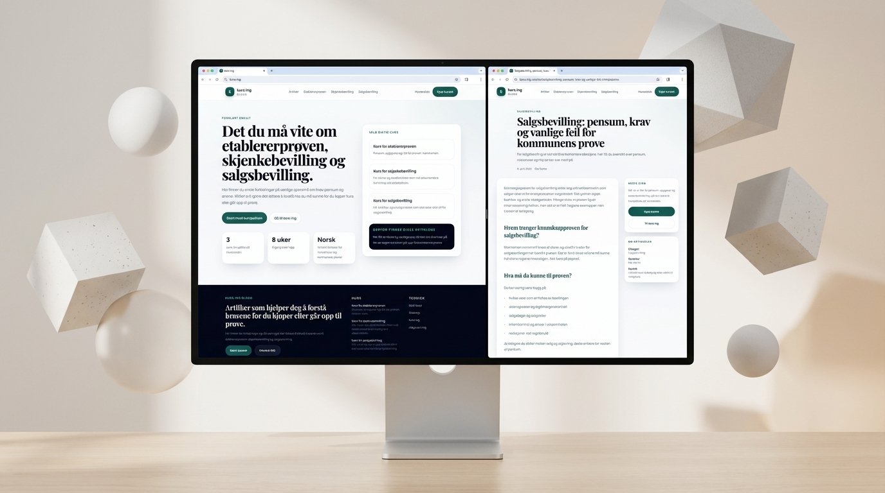
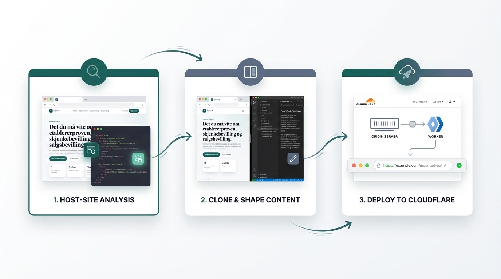

# EmDash Astro Sidecar

Launch a search-growth layer on top of your existing site without rebuilding the pages that already make money.

`emdash-astro-sidecar` is for teams that want to:

- keep the real landing pages, checkout, and core product flows exactly where they are
- add high-quality guides, explainers, local pages, and GEO/SEO content under paths like `/guide` or `/kommune`
- make that content look like part of the real brand, not like a bolted-on blog
- ship with hard proof: routing, screenshots, performance, accessibility, security, feeds, and telemetry

<p align="center">
  
</p>

## What Problem It Solves

Most content systems ask you to choose one of three bad options:

1. rebuild the whole site around the blog
2. publish on a disconnected subdomain
3. accept a generic content layer that weakens trust and conversion

This repo solves the more commercially useful problem:

1. keep the existing site intact
2. add a mounted search/content surface beside it
3. match the brand and UX closely
4. publish content that can rank, explain, and convert
5. verify the live output like an operator, not like a copywriter

The result is a sidecar content system that can drive organic growth without forcing a risky site migration.

## What You Get

- `apps/blog`
  The Astro sidecar app for articles, author pages, categories, RSS, robots, and sitemap output.
- `packages/design-clone`
  The host-site analysis pipeline that extracts theme signals and generates reusable output.
- `apps/cloudflare/workers/guide-proxy`
  The route worker that mounts the Pages deployment under a host path such as `/guide`.
- `apps/cloudflare/workers/metrics-worker`
  The telemetry surface for first-party field metrics, credentialless public-signal reporting, and Cloudflare-native edge traffic summaries.
- `scripts/audit-deployed-urls.mjs`
  The live deploy audit that captures screenshots, metadata, redirect chains, and Lighthouse category scores.
- `packages/skills`
  Repo-local rollout and quality skills for future site onboardings.

## Why It Sells

This setup is valuable when the main site already has commercial intent and you do not want a content project to destabilize it.

Use it when you need to:

- grow non-brand traffic without touching checkout or onboarding
- publish educational content that answers pre-sale questions
- add local or regulated-information sections like `/kommune`
- keep search content operationally measurable instead of “blog-shaped and unverified”

## How It Works

<p align="center">
  
</p>

### 1. Analyze The Existing Site

Run the design-clone workflow against the production site you want to support. The analyzer fetches the page, follows stylesheets, and extracts usable brand signals for layout, spacing, color, borders, and typography.

### 2. Shape A Mounted Content Surface

Configure the site and concept profile, then publish content that is specific, useful, and commercially aligned. The sidecar should help users move from questions to trust to action.

### 3. Deploy Under A Controlled Path

Build to Cloudflare Pages and mount through route workers so the content resolves cleanly under the chosen path. The repo already supports multiple sites and multiple concepts per site.

## Ship With Proof

<p align="center">
  
</p>

The deploy and telemetry stack is meant to answer the question most content projects never answer clearly:

`What is live right now, how good is it, and what signals are we actually getting back from the real web?`

It checks:

- desktop and mobile screenshots for every discovered public route
- title, description, canonical, language, H1 count, link counts, and image alt coverage
- redirect chains on legacy paths
- RSS, sitemap, and robots correctness
- local Lighthouse category scores with raw JSON artifacts, without depending on Google PSI rate limits
- first-party RUM for real users
- Cloudflare-native referrer and landing-page telemetry
- public Google-facing telemetry fallbacks when GSC/Bing auth is unavailable

Commands:

```bash
pnpm audit:deployed
pnpm audit:deployed:lighthouse
```

## Quick Start

```bash
pnpm install
pnpm design:clone -- analyze https://example.com
pnpm design:clone -- clone https://example.com
pnpm verify
pnpm audit:deployed
pnpm audit:deployed:lighthouse
```

Then configure:

- [`apps/blog/src/site-config.ts`](apps/blog/src/site-config.ts)
- [`apps/blog/site-profiles.mjs`](apps/blog/site-profiles.mjs)
- [`apps/blog/astro.config.mjs`](apps/blog/astro.config.mjs)
- [`apps/cloudflare/workers/guide-proxy/wrangler.toml`](apps/cloudflare/workers/guide-proxy/wrangler.toml)

## Branch Rule

Treat `main` as the Git default branch for this repo.

Do not infer the Git branch from a Cloudflare Pages alias. A Pages alias like `master.emdash-astro-sidecar.pages.dev` is an infrastructure hostname, not proof that `master` is the Git production branch.

Before pushing release work, verify both:

```bash
git remote show origin
git branch --show-current
```

## Release Standard

Do not ship because the app “builds.”

Ship because the live system clears the full quality bar:

```bash
pnpm verify
pnpm qa
pnpm audit:deployed
pnpm audit:deployed:lighthouse
pnpm autonomous:check-env
```

That workflow gives you:

- schema and type checks
- Astro build validation
- feed and sitemap integrity checks
- copy-quality and host-config gates
- live screenshots and URL analytics
- local Lighthouse artifacts for deployed pages
- accessibility and security gates
- credentialless public telemetry fallbacks

## Telemetry Without Provider Lock-In

The repo now supports a practical autopilot telemetry baseline even when you do not have:

- GSC OAuth
- Bing site authorization
- public CrUX data for the site yet

That means you can still run:

- first-party RUM
- public Google readiness checks
- Cloudflare-native referrer and landing-page telemetry
- best-effort search-query capture from search referrers
- public PageSpeed reporting

Read:

- [`docs/credentialless-telemetry-strategy.md`](docs/credentialless-telemetry-strategy.md)
- [`docs/telemetry-ingestion.md`](docs/telemetry-ingestion.md)

## Read Next

- [`docs/setup.md`](docs/setup.md)
- [`docs/architecture.md`](docs/architecture.md)
- [`docs/host-rollout.md`](docs/host-rollout.md)
- [`docs/deployment.md`](docs/deployment.md)
- [`docs/troubleshooting.md`](docs/troubleshooting.md)
- [`docs/cloudflare-resource-guardrails.md`](docs/cloudflare-resource-guardrails.md)
- [`docs/provider-runtime.md`](docs/provider-runtime.md)
- [`docs/telemetry-ingestion.md`](docs/telemetry-ingestion.md)
- [`docs/quality-gates.md`](docs/quality-gates.md)
- [`docs/accessibility-review-checklist.md`](docs/accessibility-review-checklist.md)
- [`docs/security-checklist.md`](docs/security-checklist.md)
- [`docs/credentialless-telemetry-strategy.md`](docs/credentialless-telemetry-strategy.md)
- [`docs/multisite-and-multi-concept.md`](docs/multisite-and-multi-concept.md)
- [`docs/municipality-content-quality.md`](docs/municipality-content-quality.md)
- [`docs/TODO.md`](docs/TODO.md)
- [`docs/world-class-quality-targets.md`](docs/world-class-quality-targets.md)
- [`docs/prd-autonomous-content-control-plane.md`](docs/prd-autonomous-content-control-plane.md)

## Repo Skills

For repeatable future rollouts, start from:

- [`packages/skills/src/host-sidecar-rollout/SKILL.md`](packages/skills/src/host-sidecar-rollout/SKILL.md)
- [`packages/skills/src/autonomous-host-operator/SKILL.md`](packages/skills/src/autonomous-host-operator/SKILL.md)
- [`packages/skills/src/quality-gates/SKILL.md`](packages/skills/src/quality-gates/SKILL.md)
- [`packages/skills/src/deployed-url-audit/SKILL.md`](packages/skills/src/deployed-url-audit/SKILL.md)

## Kommune Content

The repo also supports a second mounted concept for municipality-specific pages.

That matters when you need local or regulated information architecture that should not be mixed into the main guide/blog structure.

The current `kurs.ing/kommune` concept is driven from the structured municipality dataset in `Ola-Turmo/kommune.no.apimcp.site`, then filtered through stricter quality gates so weak municipality pages fail closed instead of shipping.

Run:

```bash
pnpm generate:municipal-pages
```

Concept separation is also enforced in normal verification:

```bash
pnpm verify:concepts
```

## License

MIT
